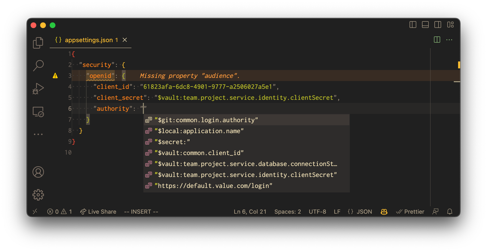

# Confix 

_Your Companion for Seamless Application Configuration_

- [Confix](#confix)
  - [Introduction](#introduction)
    - [Why Choose Confix?](#why-choose-confix)
  - [Documentation](#documentation)
  - [Code-first .NET configuration](#code-first-net-configuration)
  - [Roadmap: .NET 11 alignment](#roadmap-net-11-alignment)
  - [Contributing](#contributing)
  - [License](#license)
  - [Acknowledgements](#acknowledgements)

## Introduction 

In the modern development sphere, managing application configuration across various stages from
local development to production deployment has become a daunting task. That's where Confix steps in
to simplify and streamline the process for you. With Confix, say goodbye to the configuration
complexities and hello to a more straightforward, secure, and efficient application setup and
deployment.

**What if you could just use a simple JSON file to manage your application configuration?**

Confix provides a simplistic yet powerful toolset for managing your application configurations
effortlessly. With just the Confix CLI and VSCode, you can seamlessly transition from local
development to production deployment, ensuring consistency and reducing configuration errors.

---

### Why Choose Confix?

1. **Simplicity at its Core**:
   Running applications locally is a breeze, but deployment often brings configuration challenges. Confix eradicates these hurdles by allowing you to store configurations in a JSON file in your Git repository. Your IDE, empowered by JSON Schemas, assists in writing accurate configurations with code completion and validation.

2. **Compose with Ease**:
   Reusing shared code across multiple locations or services in enterprise settings is now simplified. Confix enables reusability and easy composition of configuration components, saving you time and ensuring consistency across your projects.

3. **Flexibility for Every Project**:
   Every configuration file in Confix is a JSON file - easy to create and consume. Regardless of your environment, if your application can load JSON files, it can utilize Confix, making your configuration management unified and straightforward.

4. **Secure Your Secrets**:
   While Confix effortlessly manages your application configuration, it also provides a mechanism for representing secrets within your configuration using variables. The actual secret storage is your choice, whether in Azure Key Vault, HashiCorp Vault, or as environment variables, ensuring your application's security is never compromised.

To get started with confix follow the [getting started guide](https://swisslife-oss.github.io/Confix/getting-started)

## Documentation

Further documentation can be accessed on our [documentation page](https://swisslife-oss.github.io/Confix).

## Code-first .NET configuration

Opt into `project.validation` in `.confixrc` to validate appsettings using `ConfixSection`,
`AddConfixOptions`, and data annotations. `confix build` also initializes the keys your
application cannot supply itself, so a missing setting appears as an empty slot to fill.
See [the guide](docs/pages/code-first.mdx) and
[the example](examples/CodeFirst). Existing GraphQL/dotnet inputs remain supported.

## Roadmap: .NET 11 alignment

Code-first validation is meant to extend the .NET options pattern, not to reimplement it.
Recursion already relies on the platform's own [`[ValidateObjectMembers]`](https://learn.microsoft.com/en-us/dotnet/core/extensions/options-validation-generator)
and `[ValidateEnumeratedItems]`. Confix targets `net10.0` today; the items below are tracked for
the move to `net11.0`.

| Item | Why it matters |
| --- | --- |
| Honour [`[ConfigurationIgnore]`](https://learn.microsoft.com/en-us/dotnet/api/microsoft.extensions.configuration.configurationignoreattribute) | Correctness gap. Every public property is currently treated as a bindable key, so a property the binder ignores is reported as valid configuration. Affects key checking and schema export. |
| Move to `IAsyncStartupValidator` | [`IStartupValidator` is obsolete in .NET 11](https://learn.microsoft.com/en-us/dotnet/core/whats-new/dotnet-11/libraries). |
| Support asynchronous validation | `AsyncValidationAttribute`, `IAsyncValidatableObject`, and `IAsyncValidateOptions` allow rules that perform I/O. Validation is synchronous today, so such rules cannot run. |
| Execute source-generated validators | An [`[OptionsValidator]`](https://learn.microsoft.com/en-us/dotnet/core/extensions/options-validation-generator) partial class produces a reflection-free `IValidateOptions<T>`. Running the generated validator instead of reflecting over data annotations makes `confix validate` and application startup agree by construction, and is AOT friendly. |
| Reconcile with [`BinderOptions.ErrorOnUnknownConfiguration`](https://learn.microsoft.com/en-us/dotnet/api/microsoft.extensions.configuration.binderoptions.erroronunknownconfiguration) | The binder can already reject unknown keys per bound type. Confix aggregates every error with its full path and is on by default, but the overlap should be an explicit decision rather than an accident. |
| Adopt `OptionsBuilder<T>.Validate<TValidator>()` | New overload that resolves the validator from DI instead of taking a delegate. |

These remain Confix's own concern, because the platform has no equivalent:

- **Coverage** — every configured section must belong to an active contract, so orphaned and
  misspelled sections are reported. The binder only ever sees the sections it is asked to bind.
- **Validating without starting the application** — contracts execute in a separate process using
  the application's own runtime and dependencies, before deployment.
- **Schema export** for editor completion over the composed configuration.

## Contributing

We welcome contributions from the community. Please open an issue or discussion with you idea/feature request and we will be happy to help you get started.

## License

This project is licensed under the MIT License - see the [LICENSE](LICENSE) file for details.

## Acknowledgements

Thanks to all our [contributors](https://github.com/SwissLife-OSS/confix/graphs/contributors).
