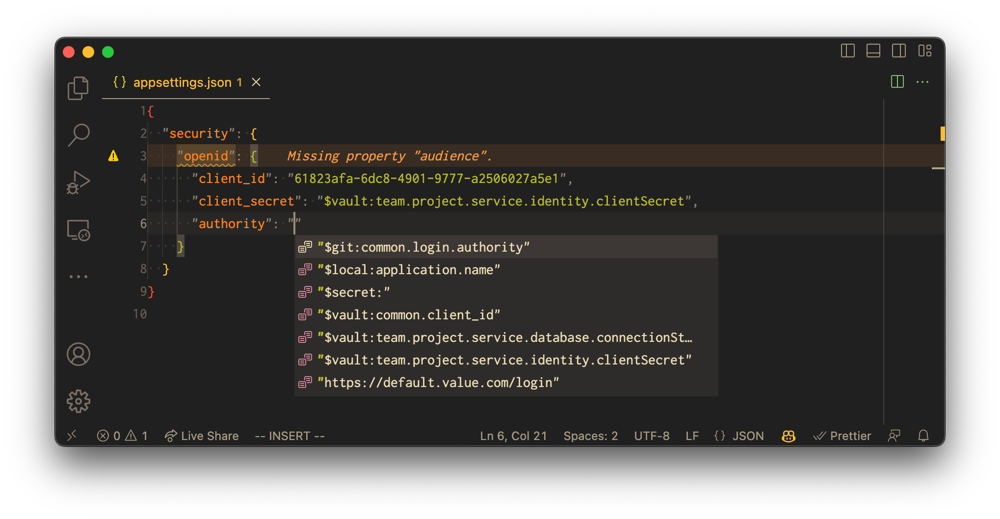

# Confix - Seamless Application Configuration

_Your Companion for Seamless Application Configuration_

- [Confix - Seamless Application Configuration](#confix---seamless-application-configuration)
  - [Introduction](#introduction)
    - [Why Choose Confix?](#why-choose-confix)
  - [Documentation](#documentation)
  - [Contributing](#contributing)
  - [License](#license)
  - [Acknowledgements](#acknowledgements)

## Introduction 

In the modern development sphere, managing application configuration across various stages from
local development to production deployment has become a daunting task. That's where Confix steps in
to simplify and streamline the process for you. With Confix, say goodbye to the configuration
complexities and hello to a more straightforward, secure, and efficient application setup and
deployment.

Confix provides a simplistic yet powerful toolset for managing your application configurations
effortlessly. With just the Confix CLI and VSCode, you can seamlessly transition from local
development to production deployment, ensuring consistency and reducing configuration errors.

---

### Why Choose Confix?

1. **Simplicity at its Core**:
   Running applications locally is a breeze, but deployment often brings configuration challenges. Confix eradicates these hurdles by allowing you to store configurations in a JSON file in your Git repository. Your IDE, empowered by JSON Schemas, assists in writing accurate configurations with code completion and validation.

2. **Compose with Ease**:
   Reusing shared code across multiple locations or services in enterprise settings is now simplified. Confix enables reusability and easy composition of configuration components, saving you time and ensuring consistency across your projects.

3. **Flexibility for Every Project**:
   Every configuration file in Confix is a JSON file - easy to create and consume. Regardless of your environment, if your application can load JSON files, it can utilize Confix, making your configuration management unified and straightforward.

4. **Secure Your Secrets**:
   While Confix effortlessly manages your application configuration, it also provides a mechanism for representing secrets within your configuration using variables. The actual secret storage is your choice, whether in Azure Key Vault, HashiCorp Vault, or as environment variables, ensuring your application's security is never compromised.

To get started with confix follow the [getting started guide](https://swisslife-oss.github.io/Confix/getting-started)

## Documentation

Further documentation can be accessed on our [documentation page](https://swisslife-oss.github.io/Confix).

## Contributing

We welcome contributions from the community. Please read our [contributing guide](CONTRIBUTING.md) to learn more about how to contribute to Confix.

## License

This project is licensed under the MIT License - see the [LICENSE](LICENSE) file for details.

## Acknowledgements

Thanks to all our [contributors](https://github.com/SwissLife-OSS/confix/graphs/contributors).