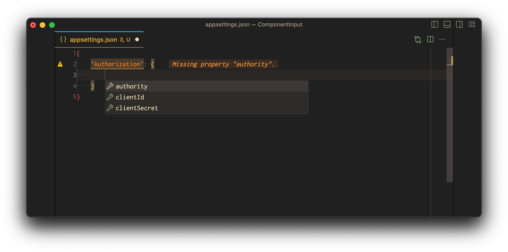

import { FileTree } from "nextra-theme-docs";

# Inputs

To work with Confix, you need to specify how it should handle the components you define.
This is done in the `.confixrc` file, where you set up the rules for dealing with component inputs.

Consider you are using a "graphql" input. In this case, you can detail your component's schema using a GraphQL file.

## Getting Started

In this example we are going to define a component called "Authorization" which will be used to define the authorization schema for our application.
What we want to do is to define a GraphQL file which will be used to define the schema for our component.

Make sure you do have a repository that has defines a `.confixrc` a `.confix.solution` and a `.confix.project` file.
For example like this:

<FileTree>
  <FileTree.Folder name="/" defaultOpen>
    <FileTree.File name=".confixrc" active />
    <FileTree.File name=".confix.solution" active />
    <FileTree.Folder name="src" defaultOpen>
      <FileTree.Folder name="Website" defaultOpen>
        <FileTree.File name=".confix.project" active />
        <FileTree.File name="appsettings.json" />
        <FileTree.File name="Program.cs" />
        <FileTree.File name="Website.csproj" />
      </FileTree.Folder>
    </FileTree.Folder>
  </FileTree.Folder>
</FileTree>

To use a input, you need to define them in the `component` section in your `.confixrc` file.
We define two inputs, one is the `graphql` input, which will be used to define the schema for our component.

```json
{
  "component": {
    "inputs": [
      {
        "type": "graphql"
      }
    ]
  },
  "project": {
    "configurationFiles": [
      {
        "type": "appsettings",
        "useUserSecrets": true
      }
    ]
  }
}
```

In the folder with the `.confix.project` file, we can now run:

```bash
confix component init Authorization
```

This will generate the `Authroization` component for us. The file structure will look like this:

<FileTree>
  <FileTree.Folder name="/" defaultOpen>
    <FileTree.File name=".confixrc" />
    <FileTree.File name=".confix.solution" />
    <FileTree.Folder name="src" defaultOpen>
      <FileTree.Folder name="website" defaultOpen>
        <FileTree.Folder name="confix" defaultOpen>
          <FileTree.Folder name="components" defaultOpen>
            <FileTree.Folder name="Authorization" defaultOpen>
              <FileTree.File name=".confix.component" active />
            </FileTree.Folder>
          </FileTree.Folder>
        </FileTree.Folder>
        <FileTree.File name=".confix.project" />
        <FileTree.File name="appsettings.json" />
        <FileTree.File name="Program.cs" />
        <FileTree.File name="Website.csproj" />
      </FileTree.Folder>
    </FileTree.Folder>
  </FileTree.Folder>
</FileTree>

now we can add a `schema.graphql` file to the `Authorization` folder.
This file will be used to define the schema for our component.

```graphql
type Configuration {
  authority: String!
  clientId: String!
  clientSecret: String!
}
```

<FileTree>
  <FileTree.Folder name="/" defaultOpen>
    <FileTree.File name=".confixrc" />
    <FileTree.File name=".confix.solution" />
    <FileTree.Folder name="src" defaultOpen>
      <FileTree.Folder name="website" defaultOpen>
        <FileTree.Folder name="confix" defaultOpen>
          <FileTree.Folder name="components" defaultOpen>
            <FileTree.Folder name="Authorization" defaultOpen>
              <FileTree.File name=".confix.component" />
              <FileTree.File name="schema.graphql" active />
            </FileTree.Folder>
          </FileTree.Folder>
        </FileTree.Folder>
        <FileTree.File name=".confix.project" />
        <FileTree.File name="appsettings.json" />
        <FileTree.File name="Program.cs" />
        <FileTree.File name="Website.csproj" />
      </FileTree.Folder>
    </FileTree.Folder>
  </FileTree.Folder>
</FileTree>

Now we can build the confix project and the component will be created.

```bash
confix build
```

This command will generate the component schema and will also validate the appsettings.json file.
We will get error messages that the appsetting.json file is missing the `Authorization` section.

<FileTree>
  <FileTree.Folder name="/" defaultOpen>
    <FileTree.File name=".confixrc" />
    <FileTree.File name=".confix.solution" />
    <FileTree.Folder name="src" defaultOpen>
      <FileTree.Folder name="website" defaultOpen>
        <FileTree.Folder name="confix" defaultOpen>
          <FileTree.Folder name="components" defaultOpen>
            <FileTree.Folder name="Authorization" defaultOpen>
              <FileTree.File name=".confix.component" />
              <FileTree.File name="schema.graphql" />
              <FileTree.File name=".schema.json" active />
            </FileTree.Folder>
          </FileTree.Folder>
        </FileTree.Folder>
        <FileTree.File name=".confix.project" />
        <FileTree.File name="appsettings.json" />
        <FileTree.File name="Program.cs" />
        <FileTree.File name="Website.csproj" />
      </FileTree.Folder>
    </FileTree.Folder>
  </FileTree.Folder>
</FileTree>

When we open the root folder now in VSCode, we get intellisense for the `appsettings.json` file.


## Supported Component Inputs:

Here is a list of currently supported component inputs:

Currently supporter components inputs are:
|Name|Descripion|
|---|---|
|`graphql`|Allows you to define a graphql file which can be used to define the json schema
|`dotnet`| This will add the components as an embedded resouource to the .net project that defines the component
