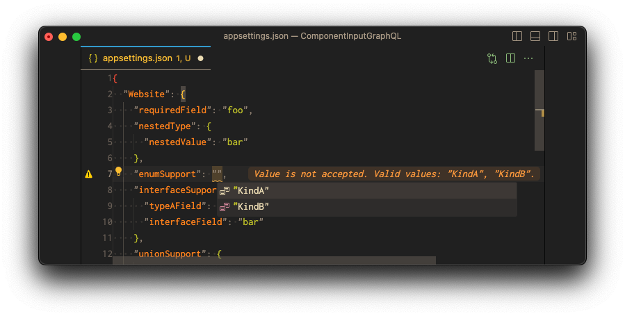
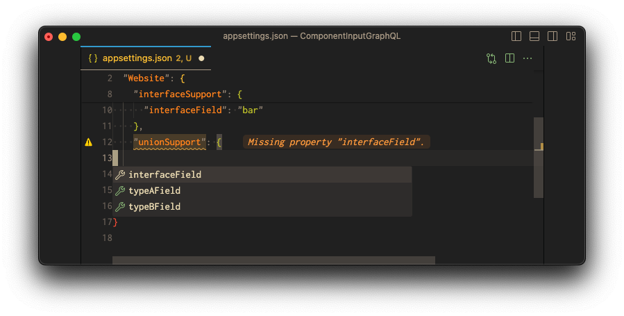
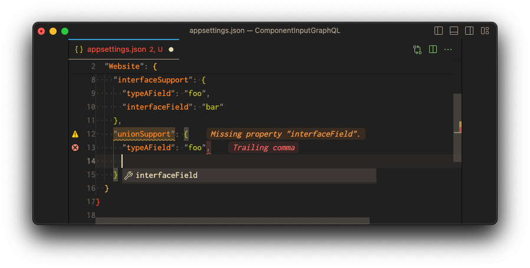
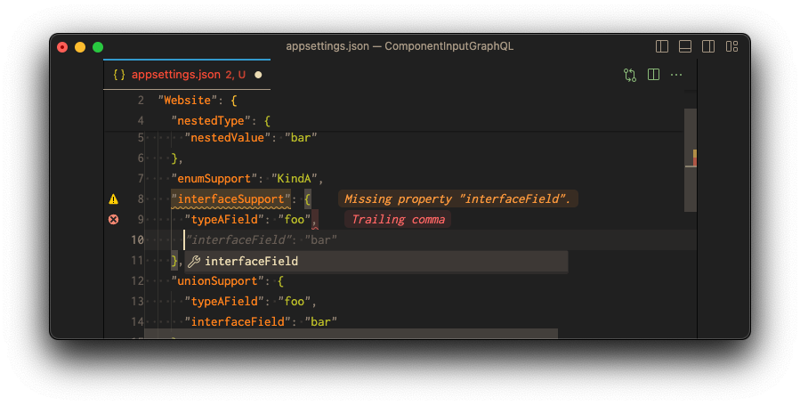
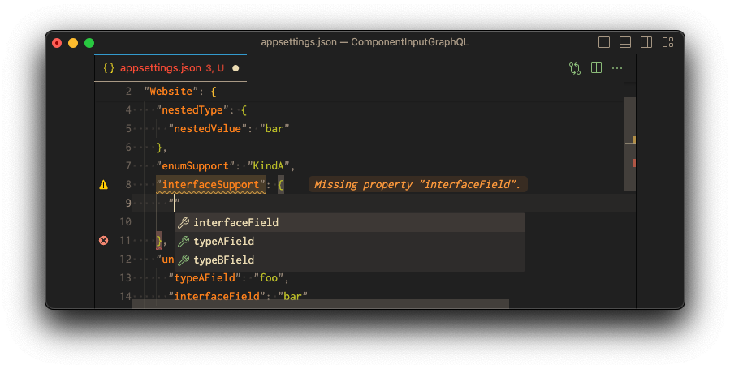
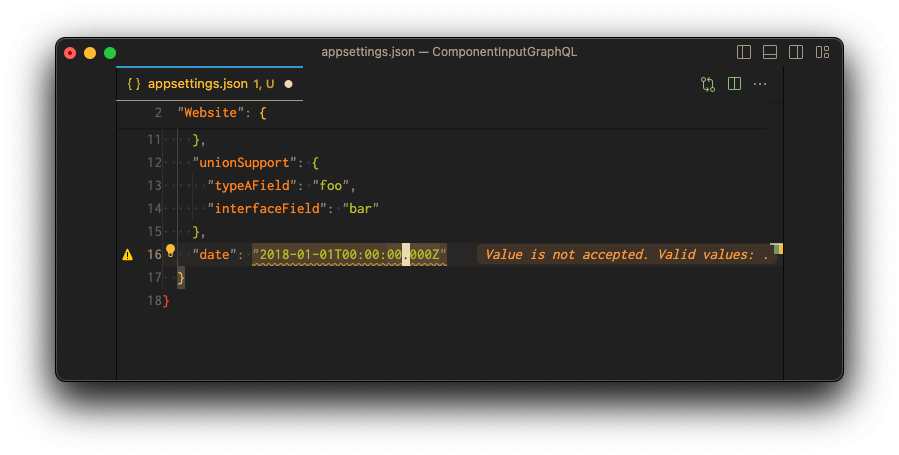

import { FileTree } from "nextra-theme-docs";

# GraphQL

The GraphQL type system describes the capabilities of a GraphQL server and is used to determine if a
query is valid. This schema is defined with the GraphQL Schema Definition Language (SDL) and is
much easier to read and write than a JSON schema.

The `graphql` input provider translates a GraphQL schema to a JSON schema. This way you can define
the shape of your configuration in a GraphQL schema.

## Configuration

```json copy filename=".confixrc"
{
  "component": {
    "inputs": [
      {
        "type": "graphql"
      }
    ]
  }
}
```

## Example

Create a `schema.graphql` file in your components folder.

<FileTree>
  <FileTree.Folder name="/" defaultOpen>
    <FileTree.File name=".confixrc" />
    <FileTree.File name=".confix.solution" />
    <FileTree.Folder name="src" defaultOpen>
      <FileTree.Folder name="Website" defaultOpen>
        <FileTree.Folder name="confix" defaultOpen>
          <FileTree.Folder name="components" defaultOpen>
            <FileTree.Folder name="Website" defaultOpen>
              <FileTree.File name=".confix.component" />
              <FileTree.File name="schema.graphql" active />
              <FileTree.File name="schema.json" />
            </FileTree.Folder>
          </FileTree.Folder>
        </FileTree.Folder>
        <FileTree.File name=".confix.project" />
        <FileTree.File name="appsettings.json" />
        <FileTree.File name="Program.cs" />
        <FileTree.File name="Website.csproj" />
      </FileTree.Folder>
    </FileTree.Folder>
  </FileTree.Folder>
</FileTree>

```graphql copy filename="schema.graphql"
type Configuration {
  requiredField: String!
  optionalField: String
  nestedType: NestedType!
  enumSupport: Kind!
  interfaceSupport: ExampleInterface!
  unionSupport: ExampleUnion!
  date: Date
  uuid: UUID
  regex: Regex
  withDefault: String @defaultValue(value: "default value")
  withVariableDefault: String @defaultValue(value: "$shared:common.authority")
}

type NestedType {
  nestedValue: String!
}

enum Kind {
  KindA
  KindB
}

interface ExampleInterface {
  interfaceField: String!
}

type ExampleA implements ExampleInterface {
  interfaceField: String!
  typeAField: String!
}

type ExampleB implements ExampleInterface {
  interfaceField: String!
  typeBField: String!
}

union ExampleUnion = ExampleA | ExampleB
```

When we now run a `confix build` in the Website folder, the GraphQL schema is translated to a
`schema.json` file.

The `appsettings.json` file is also initialized and looks like this:

```json
{
  "Website": {
    "requiredField": null,
    "nestedType": {
      "nestedValue": null
    },
    "enumSupport": null,
    "interfaceSupport": null,
    "unionSupport": null,
    "withDefault": "default value",
    "withVariableDefault": "$shared:common.authority"
  }
}
```

## GraphQL Type System Support

The GraphQL type system is very powerful and supports `Object`, `Interface`, `Union`, `Enum`,
`Input Object` and `Scalar` types. The `graphql` input provider supports all of
these types except `InputObject`.

The `Query` type of the GraphQL schema is the entry point for the configuration. If you do not have
a `Query` type, the first object type is used as the entry point.

### Nullability

In GraphQL all fields are nullable by default. If you want to make a field required, you have to
append an exclamation mark to the type. The `graphql` provider leverages this and makes all fields
that are not nullable in the GraphQL schema required in the JSON schema.

### Default Values

In common components you may also want to define default values for fields. You for example define
a shared variable as the default value and all projects that reference the component will also
use this value as soon as they are initialized

```graphql
type Configuration {
  authority: String! @defaultValue(value: "$shared:common.authority")
}
```

### Object Types

```graphql
type Example {
  stringField: String!
  intField: Int!
}
```

These are translated to JSON objects. The fields of the object type are translated to the
properties.

Learn more about [Object Types](https://graphql.org/learn/schema/#object-types-and-fields).

### Enum Types

```graphql
enum Example {
  KindA
  KindB
}
```

A enum type in GraphQL is a special kind of scalar that is restricted to a particular set of allowed
values Enum types are translated to JSON strings. The enum values are used as the allowed values.



Learn more about [Enum Types](https://graphql.org/learn/schema/#enumeration-types).

### Union Types

```graphql
type ExampleA {
  stringField: String!
}
type ExampleB {
  intField: Int!
}

union Example = ExampleA | ExampleB
```

Union types are very similar to interfaces, but they don't get to specify any common fields between
the types.

Union types are translated to JSON objects. The union types are translated to a `oneOf` schema.

This means all properties of the union types are allowed in the JSON schema if type type is not clear:

But as soon as the type is clear, only the properties of the specific type are allowed:


Learn more about [Union Types](https://graphql.org/learn/schema/#union-types).

### Interface Types

```graphql
interface Example {
  stringField: String!
}

type ExampleA implements Example {
  stringField: String!
}
type ExampleB implements Example {
  stringField: String!
  intField: Int!
}
```

Interfaces are useful for defining fields that you want to include in multiple types. Interfaces are
translated to JSON objects. The interface types are translated to a `oneOf` schema.

This means all properties of the interface types are allowed in the JSON schema if type type is not
clear:

But as soon as the type is clear, only the properties of the specific type are allowed:


### Scalars

```graphql
scalar Regex
```

GraphQL Scalars represent primitive leaf values like `String` or `Int`. The `graphql` provider
translates these scalars to JSON primitives as per the Json Schema standards, with some scalars
having an additional format specification for validation purposes.

Here's the mapping from GraphQL scalars to JSON primitives and their respective formats:

| GraphQL Scalar    | JSON Primitive | Format         |
| ----------------- | -------------- | -------------- |
| `Int`             | `integer`      |                |
| `Long`            | `integer`      |                |
| `Float`           | `number`       |                |
| `Double`          | `number`       |                |
| `Boolean`         | `boolean`      |                |
| `String`          | `string`       |                |
| `Uuid`            | `string`       | `uuid`         |
| `UUID`            | `string`       | `uuid`         |
| `Guid`            | `string`       | `uuid`         |
| `GUID`            | `string`       | `uuid`         |
| `Date`            | `string`       | `date`         |
| `DateTime`        | `string`       | `date-time`    |
| `TimeSpan`        | `string`       | `time-span`    |
| `Duration`        | `string`       | `duration`     |
| `EmailAddress`    | `string`       | `email`        |
| `IdnEmailAddress` | `string`       | `idn-email`    |
| `HostName`        | `string`       | `hostname`     |
| `IdnHostName`     | `string`       | `idn-hostname` |
| `IpAddress`       | `string`       | `ipv4`         |
| `Ip`              | `string`       | `ipv4`         |
| `Ipv4`            | `string`       | `ipv4`         |
| `Ipv6`            | `string`       | `ipv6`         |
| `Uri`             | `string`       | `uri`          |
| `Url`             | `string`       | `uri`          |
| `JsonPointer`     | `string`       | `json-pointer` |
| `RegEx`           | `string`       | `regex`        |
| `Regex`           | `string`       | `regex`        |
| `Json`            | `object`       | `json`         |
| `Any`             | `object`       | `json`         |

Here is an example of the `Date` scalar. The `format` property is set to `date` so it rejects a date
time value.



[Learn more about Scalars](https://graphql.org/learn/schema/#scalar-types).
