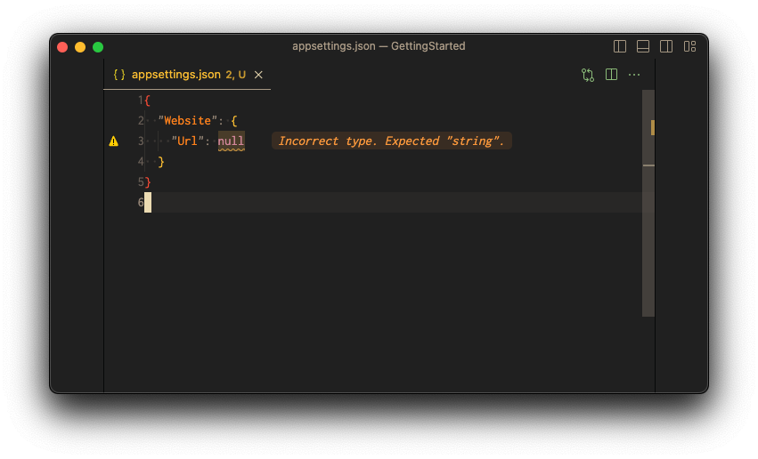
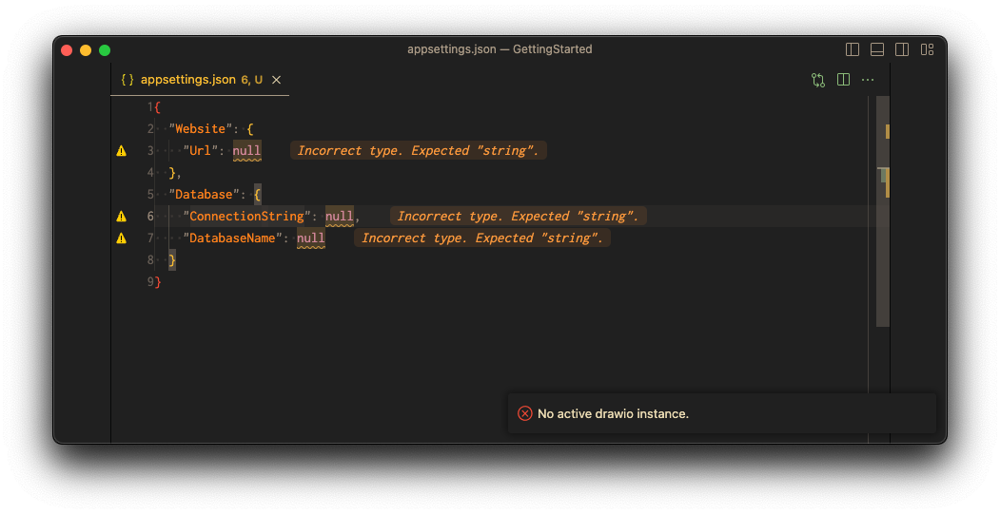

import { Callout } from "nextra/components";
import { Steps, FileTree, Tabs, Tab } from "nextra-theme-docs";

# Exploring Components

In Confix, every configuration is broken down into elements known as [components](/components).
These components act as a blueprint, ensuring your configuration aligns with a defined structure or
schema.

<Callout type="info">
  You technically don't need components. You can also create a configuration and
  just use variables without having a schema. Without components you will not
  have any validation or autocompletion though.
</Callout>

Components can be defined per application but also can be shared between projects.

## Defining a local component

Let's start by defining a component that's specific to our application. First, navigate to the
`Website` folder and execute the following command:

```bash copy
confix component init Website
```

<FileTree>
  <FileTree.Folder name="/" defaultOpen>
    <FileTree.File name=".confixrc" />
    <FileTree.File name=".confix.solution" />
    <FileTree.Folder name="src" defaultOpen>
      <FileTree.Folder name="website" defaultOpen>
        <FileTree.Folder name="confix" defaultOpen>
          <FileTree.Folder name="components" defaultOpen>
            <FileTree.Folder name="Website" defaultOpen>
              <FileTree.File name=".confix.component" active />
            </FileTree.Folder>
          </FileTree.Folder>
        </FileTree.Folder>
        <FileTree.File name=".confix.project" />
        <FileTree.File name="appsettings.json" />
        <FileTree.File name="Program.cs" />
        <FileTree.File name="Website.csproj" />
      </FileTree.Folder>
    </FileTree.Folder>
  </FileTree.Folder>
</FileTree>

This command will create a new folder in `Website` called `confix/components/Website`.
At the moment this folder only contains one file, the `.confix.component` file.

Now, let's create a schema for our component. This schema will define the structure of our component
and give us autocompletion and validation.

```json copy
{
  "$schema": "https://json-schema.org/draft/2020-12/schema",
  "$id": "https://example.com/product.schema.json",
  "title": "product",
  "description": "A product from Acme's catalog",
  "type": "object",
  "properties": {
    "Url": {
      "description": "The Url of the website",
      "type": "string"
    }
  },
  "required": ["Url"]
}
```

<FileTree>
  <FileTree.Folder name="/" defaultOpen>
    <FileTree.File name=".confixrc" />
    <FileTree.File name=".confix.solution" />
    <FileTree.Folder name="src" defaultOpen>
      <FileTree.Folder name="website" defaultOpen>
        <FileTree.Folder name="confix" defaultOpen>
          <FileTree.Folder name="components" defaultOpen>
            <FileTree.Folder name="Website" defaultOpen>
              <FileTree.File name=".confix.component" />
              <FileTree.File name="schema.json" active />
            </FileTree.Folder>
          </FileTree.Folder>
        </FileTree.Folder>
        <FileTree.File name=".confix.project" />
        <FileTree.File name="appsettings.json" />
        <FileTree.File name="Program.cs" />
        <FileTree.File name="Website.csproj" />
      </FileTree.Folder>
    </FileTree.Folder>
  </FileTree.Folder>
</FileTree>

When we run the command `confix build` in the `Website` folder we now see that our component is
loaded and that the configuration we have created is applied.

```bash copy
confix build
```

Output:

```ansi
✓ Running in scope Project
✓ Configuration loaded
✓ Active Environment is prod
✓ Component inputs loaded
✓ Loaded 1 components
  -  Website
✓ Schema composition completed for project src.Website
✓ Schema is stored at '/Users/ex/Confix/examples/GettingStarted/.confix/.schemas/src.Website.schema.json'
i Loaded schema from cache for project src.Website
  Persisting configuration file '/Users/ex/.microsoft/usersecrets/f736895a-96b8-471a-8502-09b0e07dfdb8/secrets.json'
  Detected 0 variables
✕ The configuration file '/Users/ex/Confix/examples/GettingStarted/src/Website/appsettings.json' is invalid.
 └── Website
    └── Url
        ├── ✕ Value is "null" but should be "string"
        └── ✕ Expected value to match one of the values specified by the enum
✕ Confix failed.
  The configuration files are invalid.
```

When we open the `appsettings.json` file we see that the configuration was initialized and `Url` is
set to `null`. The intellisense tells us that the `Url` cannot be empty and has to have a value.



## Using input providers

Defining JSON schemas is a pain. It's a lot of work and it's easy to make mistakes. Confix has a
feature called `Component Inputs`. These allow you to process components and generate a schema
based on the result. We will use the `graphql` provider to generate a schema based on a GraphQL
file.

For this we first need to configure the input in the `.confixrc`.

```json filename=".confixrc" copy
{
  "component": {
    "inputs": [
      {
        "type": "graphql"
      }
    ]
  },
  "project": {
    "configurationFiles": [
      {
        "type": "appsettings",
        "useUserSecrets": true
      }
    ]
  }
}
```

Now we can define a `schema.graphql` file in the component folder and run `confix build` again.

<Tabs items={['schema.graphql', 'location', 'output']}>
  <Tab>

```graphql filename="schema.graphql" copy
type Configuration {
  Url: String!
  Database: Database!
}
type Database {
  ConnectionString: String!
  DatabaseName: String!
}
```

  </Tab>
  <Tab>

<FileTree>
  <FileTree.Folder name="/" defaultOpen>
    <FileTree.File name=".confixrc" />
    <FileTree.File name=".confix.solution" />
    <FileTree.Folder name="src" defaultOpen>
      <FileTree.Folder name="website" defaultOpen>
        <FileTree.Folder name="confix" defaultOpen>
          <FileTree.Folder name="components" defaultOpen>
            <FileTree.Folder name="Website" defaultOpen>
              <FileTree.File name=".confix.component" />
              <FileTree.File name="schema.graphql" active />
              <FileTree.File name="schema.json" />
            </FileTree.Folder>
          </FileTree.Folder>
        </FileTree.Folder>
        <FileTree.File name=".confix.project" />
        <FileTree.File name="appsettings.json" />
        <FileTree.File name="Program.cs" />
        <FileTree.File name="Website.csproj" />
      </FileTree.Folder>
    </FileTree.Folder>
  </FileTree.Folder>
</FileTree>
  </Tab>
  <Tab>

```ansi
✓ Running in scope Solution
✓ Configuration loaded
  Project detected: Website /Users/ex/confix/examples/GettingStarted/src/Website/.confix.project
✓ Running in scope Project
✓ Configuration loaded
✓ Active Environment is prod
✓ Component inputs loaded
✓ Loaded 1 components
  -  Website
✓ Schema composition completed for project src.Website
✓ Schema is stored at '/Users/ex/confix/examples/GettingStarted/.confix/.schemas/src.Website.schema.json'
i Loaded schema from cache for project src.Website
  Persisting configuration file '/Users/ex/.microsoft/usersecrets/f736895a-96b8-471a-8502-09b0e07dfdb8/secrets.json'
  Detected 0 variables
✕ The configuration file '/Users/ex/confix/examples/GettingStarted/src/Website/appsettings.json' is invalid.

└── Website
    ├── Url
    │   ├── ✕ Value is "null" but should be "string"
    │   └── ✕ Expected value to match one of the values specified by the enum
    └── Database
        ├── ConnectionString
        │   ├── ✕ Value is "null" but should be "string"
        │   └── ✕ Expected value to match one of the values specified by the enum
        └── DatabaseName
            ├── ✕ Value is "null" but should be "string"
            └── ✕ Expected value to match one of the values specified by the enum
✕ Confix failed.
  The configuration files are invalid.
```

  </Tab>
</Tabs>

The schema graphql file is now processed and translated into a JSON schema.

## Sharing components

Now, the database part of our configuration can be used in multiple projects.
When we create a package for the Database connection, we can share all the common settings and APIs between projects.
This way adding a database to a new project is as easy as adding a NuGet package.

Confix allows you to share components between projects.
There are different ways to do this. A component can be defined on a shared registry, e.g. a Git repository.
In case of a shared project, there is better way though.
You can ship the component together with the package and confix automatically recognizes the component.

This has some advantages:

- The component is versioned together with the source code. This means that you can evolve the shape of the configuration together with the component. If you decide to introduce a breaking change in the configuration, once you upgrade the package to this version, confix will tell you that the configuration is invalid.
- There is no external component needed (like a git repository). You just reference the package and you are good to go.

First, to make the components discoverable in .NET, we need a special "component input".
This input will register the component as a embedded resource in the package.

Secondly, we need to tell confix to look for components in the package. For this we use a "component provider".
Component providers are responsible for loading components from different sources e.g. `git` or packages

<Callout type="info">
  We are very open to add support for e.g. Maven, NPM or other package managers.
  If you need this, please open an issue on GitHub.
</Callout>

```json filename=".confixrc" copy
{
  "component": {
    "inputs": [
      {
        "type": "graphql"
      },
      {
        "type": "dotnet"
      }
    ]
  },
  "project": {
    "configurationFiles": [
      {
        "type": "appsettings",
        "useUserSecrets": true
      }
    ],
    "componentProviders": [
      {
        "name": "dotnet",
        "type": "dotnet-package"
      }
    ]
  }
}
```

Lets create a shared database component.

<Steps>
### Creating the package

Navigate to the /src folder and execute the following command:

```bash copy
cd src
dotnet new classlib -n Database
cd Database
dotnet add package Microsoft.Extensions.DependencyInjection
```

### Add an extension method

Add an extension method to the class library that registers the component.

```csharp filename="src/Database/DatabaseServiceCollectionExtensions.cs" copy
using Microsoft.Extensions.DependencyInjection;

namespace Database;

public static class DatabaseServiceCollectionExtensions
{
    public static void AddDatabase(this IServiceCollection services)
    {
        // nothing to do here
    }
}
```

### Initialize confix

Create a confix project and a component to the Database package

```bash copy
cd src/Database
confix project init
confix component init Database
```

### Configure the schema

Add a schema to the component

```graphql filename="src/Database/confix/components/Database/schema.graphql" copy
type Configuration {
  ConnectionString: String!
  DatabaseName: String!
}
```

### Reference the component

Reference the package in the `Website` project

```bash
cd src/Website
dotnet add reference ../Database
```

### Update the `Website` config

Remove the Database configuration from the `Website` component

```graphql filename="src/Website/confix/components/Website/schema.graphql" copy
type Configuration {
  Url: String!
}
```

### Use the component

Use the component in the `Website` project

<Callout type="warning">
  A reference to the package is not enough. You need to **use** the package in
  your code. Otherwise .NET will treeshake the package and it will not be
  included in the final build.
</Callout>

```csharp filename="src/Website/Program.cs" copy /builder.Services.AddDatabase();/ /using Database;/
using Database;

var builder = WebApplication.CreateBuilder(args);
builder.Services.AddDatabase();
var app = builder.Build();

app.MapGet("/", () => "Hello World!");

app.Run();
```

</Steps>

In the end the folder structure should look like this:

<Tabs items={["Folder", "Database Schema", "Website Schema", "Program.cs", "Extension"]}>
  <Tab>
    <FileTree>
      <FileTree.Folder name="/" defaultOpen>
        <FileTree.File name=".confixrc" />
        <FileTree.File name=".confix.solution" />
        <FileTree.Folder name="src" defaultOpen>
          <FileTree.Folder name="Database" defaultOpen>
            <FileTree.Folder name="confix" defaultOpen>
              <FileTree.Folder name="components" defaultOpen>
                <FileTree.Folder name="Database" defaultOpen>
                  <FileTree.File name=".confix.component" />
                  <FileTree.File name="schema.graphql" />
                  <FileTree.File name="schema.json" />
                </FileTree.Folder>
              </FileTree.Folder>
            </FileTree.Folder>
            <FileTree.File name=".confix.project" />
            <FileTree.File name="DatabaseServiceCollectionExtensions.cs" />
            <FileTree.File name="Database.csproj" />
          </FileTree.Folder>
          <FileTree.Folder name="Website" defaultOpen>
            <FileTree.Folder name="confix" defaultOpen>
              <FileTree.Folder name="components" defaultOpen>
                <FileTree.Folder name="Website" defaultOpen>
                  <FileTree.File name=".confix.component" />
                  <FileTree.File name="schema.graphql" />
                  <FileTree.File name="schema.json" />
                </FileTree.Folder>
              </FileTree.Folder>
            </FileTree.Folder>
            <FileTree.File name=".confix.project" />
            <FileTree.File name="appsettings.json" />
            <FileTree.File name="Program.cs" />
            <FileTree.File name="Website.csproj" />
          </FileTree.Folder>
        </FileTree.Folder>
      </FileTree.Folder>
    </FileTree>
  </Tab>
  <Tab>
    ```graphql filename="src/Database/confix/components/Database/schema.graphql" copy
    type Configuration {
      ConnectionString: String!
      DatabaseName: String!
    }
    ```
  </Tab>
  <Tab>
    ```graphql filename="src/Website/confix/components/Website/schema.graphql" copy
    type Configuration {
      Url: String!
    }
    ```
  </Tab>
  <Tab>
    ```csharp filename="src/Website/Program.cs" copy /builder.Services.AddDatabase();/ /using Database;/
    using Database;

    var builder = WebApplication.CreateBuilder(args);
    builder.Services.AddDatabase();
    var app = builder.Build();

    app.MapGet("/", () => "Hello World!");

    app.Run();

    ```

  </Tab>
  <Tab>

    ```csharp filename="src/Database/DatabaseServiceCollectionExtensions.cs" copy
    using Microsoft.Extensions.DependencyInjection;

    namespace Database;

    public static class DatabaseServiceCollectionExtensions
    {
        public static void AddDatabase(this IServiceCollection services)
        {
            // nothing to do here
        }
    }
    ```

</Tab>
</Tabs>

When we now run confix build, the component from the package is recognized.

<Tabs items={["VSCode", "Output"]}>
  <Tab>



  </Tab>
  <Tab>
    ```ansi 
    ✓ Running in scope Solution
    ✓ Configuration loaded    
      Project detected: Website /Users/ex/confix/examples/GettingStarted/src/Website/.confix.project
    ✓ Running in scope Project
    ✓ Configuration loaded    
    ✓ Active Environment is prod    
    ✓ Component inputs loaded       
    ✓ Loaded 2 components           
      -  @dotnet-package/Website    
      -  @dotnet-package/Database   
    ✓ Schema composition completed for project src.Website
    ✓ Schema is stored at '/Users/ex/confix/examples/GettingStarted/.confix/.schemas/src.Website.schema.json'
    ✓ IntelliJ IDEA settings file updated: /Users/ex/confix/examples/GettingStarted/.idea/.idea.GettingStarted/.idea/jsonSchemas.xmlg the schemas configuration for IDE...
    i Loaded schema from cache for project src.Website
      Persisting configuration file '/Users/ex/.microsoft/usersecrets/f736895a-96b8-471a-8502-09b0e07dfdb8/secrets.json'
      Detected 0 variables                         
    ✕ The configuration file '/Users/ex/confix/examples/GettingStarted/src/Website/appsettings.json' is invalid.
                                                   
    ├── Websitethe schemas configuration for IDE...
    │   └── Url                                    
    │       ├── ✕ Value is "null" but should be "string"
    │       └── ✕ Expected value to match one of the values specified by the enum
    └── Database
        ├── ConnectionString
        │   ├── ✕ Value is "null" but should be "string"
        │   └── ✕ Expected value to match one of the values specified by the enum
        └── DatabaseName
            ├── ✕ Value is "null" but should be "string"
            └── ✕ Expected value to match one of the values specified by the enum
    ✕ Confix failed.
      The configuration files are invalid.
    ```
  </Tab>
</Tabs>

The schema of this component is embedded in the package and is automatically loaded by confix.
This means that you can also distribute the component as a NuGet package and use it in other projects.

[Continue to the next section to learn about variables.](/getting-started/4-using-variables)
