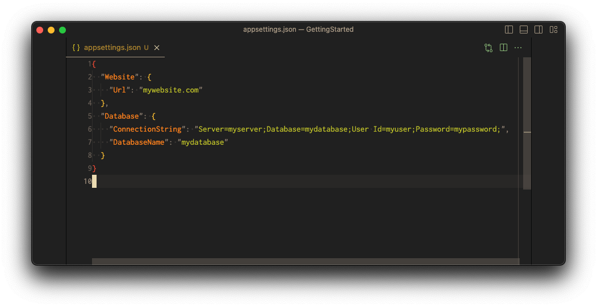
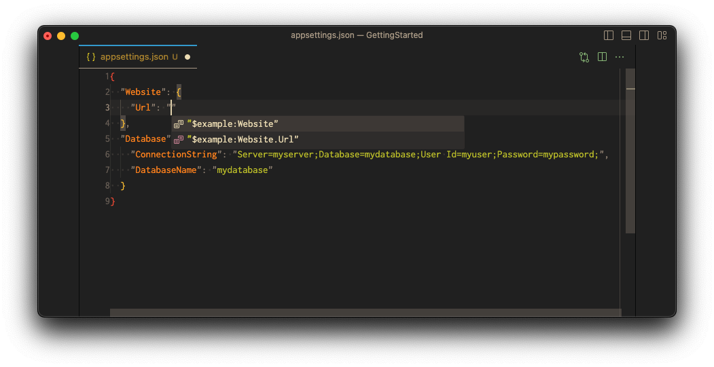

import { Callout } from "nextra/components";
import { Steps, FileTree, Tabs, Tab } from "nextra-theme-docs";

# Using Variables

Let's take a moment to review our progress.

We have created a component that defines the structure of our configuration.
Now, with a schema in place, we've got a structured configuration, complete with autocompletion and validation features.

It's time to fill in the gaps to finalize a valid configuration:



To build our Confix configuration, execute the `confix build` command and confirm the configuration's validity.

```ansi
✓ Running in scope Solution
✓ Configuration loaded
✓ Running in scope Component
✓ Configuration loaded
✓ Component inputs loaded
  Building component...
  Building component completed
✓ Running in scope Component
✓ Configuration loaded
✓ Component inputs loaded
  Building component...
  Building component completed
  Project detected: Database /Users/ex/GettingStarted/src/Database/.confix.project
✓ Running in scope Project
✓ Configuration loaded
  The project directory '/Users/ex/GettingStarted/src/Database' will be treated as a component only project as it does not contain a appsettings.json file.
✓ Active Environment is prod
  Skipped command execution build because no configuration files were found.
  Project detected: Website /Users/ex/GettingStarted/src/Website/.confix.project
✓ Running in scope Project
✓ Configuration loaded
✓ Active Environment is prod
✓ Component inputs loaded
✓ Loaded 2 components
  -  @dotnet-package/Website
  -  @dotnet-package/Database
✓ Schema composition completed for project src.Website
✓ Schema is stored at '/Users/ex/GettingStarted/.confix/.schemas/src.Website.schema.json'
✓ IntelliJ IDEA settings file updated: /Users/ex/GettingStarted/.idea/.idea.GettingStarted/.idea/jsonSchemas.xml
i Loaded schema from cache for project src.Website
  Persisting configuration file '/Users/ex/.microsoft/usersecrets/f736895a-96b8-471a-8502-09b0e07dfdb8/secrets.json'
  Detected 0 variables
✓ The configuration file '/Users/ex/GettingStarted/src/Website/appsettings.json' is valid.
  Persisting configuration file '/Users/ex/.microsoft/usersecrets/f736895a-96b8-471a-8502-09b0e07dfdb8/secrets.json'
```

However, we want to avoid embedding a `ConnectionString` directly in our source code, and we'd like the flexibility to set different `Url` s for various environments (we'll introduce this shortly).

For this we can use variables. Variables are placeholders for the actual value.
On `confix build` these variables are replaced.
If you use the `appsettings` as a configuration file, the variables are not replace in the `appsettings.json` but stored in [User Secrets](https://learn.microsoft.com/en-us/aspnet/core/security/app-secrets?view=aspnetcore-7.0&tabs=windows)

Here's where variables come into play. They act as placeholders for actual values. When running `confix build`, these variables get substituted. If you use `appsettings` as your configuration file, note that variables remain unchanged in the `appsettings.json` file but are stored in [User Secrets](https://learn.microsoft.com/en-us/aspnet/core/security/app-secrets?view=aspnetcore-7.0&tabs=windows).

Confix offers a variety of "variable providers" that store the values of these variables. A straightforward choice is the `local` variable provider, which sources variable values from a JSON file, ideal for storing non-sensitive, environment-specific data.

The `git` variable provider is another option, allowing the storage of non-sensitive data in a git repository for shared access among developers, typically used for settings like `authority`.

For handling sensitive data like connection strings or passwords, confix has dedicated variable providers. At present, you can opt for `azure-keyvault`, storing values securely in a keyvault, or `secret`, employing public-private key encryption to save values in a JSON file.

Explore more about variable providers in the [variable documentation](/variables).

## Using the Local Variable Provider

For simplicity, we'll use the `local` variable provider to store our `ConnectionString` and `Url` values. This is obviously not a secure approach, but it's a good starting point to explain how the providers work.

<Callout type="info">
  In a real scenario you probably want to use something like the
  [`azure-keyvault`](/variables/azure-keyvault) or the
  [`secret`](/variables/secrets) provider to secure your sensitive data.
</Callout>

As explained before, to discover variables we need to config `variableProviders`. We have to add this to the `.confixrc`:

```json filename=".confixrc" copy
{
  "component": {
    "inputs": [
      {
        "type": "graphql"
      },
      {
        "type": "dotnet"
      }
    ]
  },
  "project": {
    "configurationFiles": [
      {
        "type": "appsettings",
        "useUserSecrets": true
      }
    ],
    "componentProviders": [
      {
        "name": "dotnet",
        "type": "dotnet-package"
      }
    ],
    "variableProviders": [
      {
        "name": "example",
        "type": "local",
        "path": "$project:/variables.json"
      }
    ]
  }
}
```

## Defining variables

The variable provider `example` of the type `local` is configured to use the file `variables.json` in the project direcotries.
Variables always start `${name}:` (in out case `$example:`) and then are followed by a path separated by `.`.

Lets set the variable `$example:Website.Url`

```bash
cd src/Website
confix variable set
```

```ansi
✓ Running in scope Project
✓ Configuration loaded
✓ Active Environment is prod
? Variable name: $example:Website.Url
? Variable value: *************
! The local variable file was not found at the expected location. Created empty file at: '/Users/ex/GettingStarted/src/Website/variables.json'
✓ Variable $example:Website.Url set successfully.
```

Now there is a new file in our project

<FileTree>
  <FileTree.Folder name="/" defaultOpen>
    <FileTree.File name=".confixrc" />
    <FileTree.File name=".confix.solution" />
    <FileTree.Folder name="src" defaultOpen>
      <FileTree.Folder name="Database">
        <FileTree.Folder name="confix" defaultOpen>
          <FileTree.Folder name="components" defaultOpen>
            <FileTree.Folder name="Database" defaultOpen>
              <FileTree.File name=".confix.component" />
              <FileTree.File name="schema.graphql" />
              <FileTree.File name="schema.json" />
            </FileTree.Folder>
          </FileTree.Folder>
        </FileTree.Folder>
        <FileTree.File name=".confix.project" />
        <FileTree.File name="DatabaseServiceCollectionExtensions.cs" />
        <FileTree.File name="Database.csproj" />
      </FileTree.Folder>
      <FileTree.Folder name="Website" defaultOpen>
        <FileTree.Folder name="confix">
          <FileTree.Folder name="components" defaultOpen>
            <FileTree.Folder name="Website" defaultOpen>
              <FileTree.File name=".confix.component" />
              <FileTree.File name="schema.graphql" />
              <FileTree.File name="schema.json" />
            </FileTree.Folder>
          </FileTree.Folder>
        </FileTree.Folder>
        <FileTree.File name=".confix.project" />
        <FileTree.File name="appsettings.json" />
        <FileTree.File name="Program.cs" />
        <FileTree.File name="variables.json" active />
        <FileTree.File name="Website.csproj" />
      </FileTree.Folder>
    </FileTree.Folder>
  </FileTree.Folder>
</FileTree>

```json filename="src/Website/variables.json" copy
{
  "Website": {
    "Url": "https://localhost:5001"
  }
}
```

We can run `confix variable list` to see a list of all available variables:

<Tabs items={["Command", "Output"]}>
  <Tab>
```bash
confix variable list
```

  </Tab>
  <Tab>
    ```ansi
✓ Running in scope Project
✓ Configuration loaded
✓ Active Environment is prod
  $example:Website
  $example:Website.Url    
    ```
  </Tab>
</Tabs>

When we do a `confix restore` the variables become available as intellisense the configuration file.

<Tabs items={["VSCode", "Command", "Output"]}>
  <Tab>
    
  </Tab>

  <Tab>

```bash
cd src/Website
confix restore
```

  </Tab>
  <Tab>
    ```ansi
✓ Running in scope Project
✓ Configuration loaded
✓ Active Environment is prod
✓ Running in scope Project
✓ Configuration loaded
✓ Active Environment is prod
✓ Component inputs loaded
✓ Loaded 2 components
  -  @dotnet-package/Website
  -  @dotnet-package/Database
✓ Schema composition completed for project src.Website
✓ Schema is stored at '/Users/ex/GettingStarted/.confix/.schemas/src.Website.schema.json'
✓ IntelliJ IDEA settings file updated: /Users/ex/GettingStarted/.idea/.idea.GettingStarted/.idea/jsonSchemas.xml
    ```
  </Tab>
</Tabs>

## Referencing variables

Up until now, we've only defined variables. Now we'll use them in our configuration.

```json filename="src/Website/appsettings.json" copy /$example:Website.Url/
{
  "Website": {
    "Url": "$example:Website.Url"
  },
  "Database": {
    "ConnectionString": "Server=myserver;Database=mydatabase;User Id=myuser;Password=mypassword;",
    "DatabaseName": "mydatabase"
  }
}
```

When we now run 'confix build' the variables are replaced with the values from the variable provider.
As we use the `appsettings` configuration file, the variables are not replaced in the `appsettings.json` but stored in user secrets.

<Tabs items={["appsettings.json", "usersecrets.json", "Command", "Output"]}>
  <Tab>
  ```json /$example:Website.Url/
    {
        "Website": {
            "Url": "$example:Website.Url"
        },
        "Database": {
            "ConnectionString": "Server=myserver;Database=mydatabase;User Id=myuser;Password=mypassword;",
            "DatabaseName": "mydatabase"
        }
    }
```
  </Tab>
  <Tab>
  ```json /mywebsite.com/
    {
        "Website": {
            "Url": "mywebsite.com"
        },
        "Database": {
            "ConnectionString": "Server=myserver;Database=mydatabase;User Id=myuser;Password=mypassword;",
            "DatabaseName": "mydatabase"
        }
    }
```
  </Tab>

  <Tab>

```bash
cd src/Website
confix restore
```

  </Tab>
  <Tab>
    ```ansi
✓ Running in scope Project
✓ Configuration loaded
✓ Active Environment is prod
✓ Running in scope Project
✓ Configuration loaded
✓ Active Environment is prod
✓ Component inputs loaded
✓ Loaded 2 components
  -  @dotnet-package/Website
  -  @dotnet-package/Database
✓ Schema composition completed for project src.Website
✓ Schema is stored at '/Users/ex/GettingStarted/.confix/.schemas/src.Website.schema.json'
✓ IntelliJ IDEA settings file updated: /Users/ex/GettingStarted/.idea/.idea.GettingStarted/.idea/jsonSchemas.xml
    ```
  </Tab>
</Tabs>

If you run the sample app, you can open http://localhost:5000 and see the configured value.

<Callout type="warning">
In .NET user secrets are registered by default. Meaning you can easily access
them in your code though the `IConfiguration` interface. User secrets are
**ONLY AVAILABLE** when you run your application in **DEVELOPMENT MODE**.

User secrets are also only registered when you have **NOT** registered any other
configuration providers e.g. `.AddJsonFile("appsettings.json")` or
`.AddEnvironmentVariables()`.

If you change the default configuration then you have to register the user secrets again.

</Callout>

[Continue to the next section to learn about environments.](/getting-started/5-building-environments)
