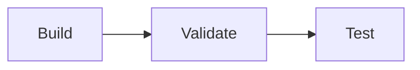
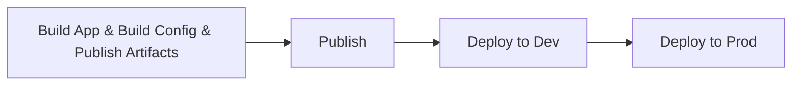

import { Callout } from "nextra/components";
import { Steps, FileTree, Tabs, Tab } from "nextra-theme-docs";

# Deploying your Application

There are many ways how you can deploy your application with confix.
As the configuration in the end it will just be a JSON file.
How and when you build this file is up to you.
This guide will show you some options how you can do this, but after all, do it the way it fits your devops process.

We recommend you to have a look at the [Deployments](/deployements) to find the best way for you.

## CI/DI Pipeline

Before you can use confix in your CI/CD pipeline you need to remember a few things:

- Make sure confix is installed on the build server
- Make sure that all secrets, credentials etc. are configured on your build server. e.g. `azure-keyvault` needs to do `az login` and `git` providers may require credentials too
- If you use .net, make sure that you disable `useUserSecrets` in your `confix.json` file. Otherwise the build will build a usersecrets file instead of replacing the variables in the appsettings.json file.
  you can run the following command to disable it:

```bash
confix config set "project.configurationFiles[0].useUserSecrets" false
```

The CI/DI setup that we recommend is to have a build pipeline that builds your application and a release pipeline that deploys your application.

The build pipeline should build your application and run the `confix validate` command to validate your configuration files.
e.g:



The release pipeline should run the `confix build` command to build your configuration files and have different stages for each environment to deploy.
e.g.



## Validating your configuration

You can use the `confix validate` command to validate your configuration files in the pull request pipeline.
You probably want to do this before you merge the PR to make sure that the configuration is valid.

```bash
confix validate --environment=dev
```

## Building your configuration

To build a configuration in a CI/CD pipeline you can use the `confix build` command.
This will replace all the placeholders in your configuration files with the values from the variables.
In case you want to build more than one enviromnet file, you can use the `--output-file` parameter to specify the output file to avoid overriding each other.

```bash
confix build --environment=dev --output-file ./appsettings_dev.json
confix build --environment=prod --output-file ./appsettings_prod.json
```

## Flows

This section will show you a few concepts on how you can use confix in specific deployment scenarios.
These are just examples that we have used in the past and that worked for us.

### Kubernetes

1. Build the configuration files once you tag your release
2. Encrypt the configuration files & store them on the pipeline
3. When you deploy your application, decrypt the configuration files and mount them as a volume

### On Premise

1. Build the configuration files once you tag your release
2. Encrypt the configuration files & store them on the pipeline
3. When you deploy your application, decrypt the configuration files and copy them to the server

### Docker (Runtime)

1. Do not build the configuration files in the pipeline
2. Replace the placeholders in the configuration files at runtime (e.g. using a startup script or init container)

<Callout type="info">
  With this you have a dependency to variable providers in your runtime
  environment. Meaning, if the providers are not reachable, your app will not
  start
</Callout>

---

Congratulations on completing the Getting Started Guide! You have now laid a solid foundation for
your journey with Confix. You've installed the software, created your first configuration, explored
components, experienced the power of variables, built environments, and learned about
deploying your application.

## What's Next?

### [Give us a star on GitHub 🤩](https://github.com/SwissLife-OSS/Confix)

Consider starting your contribution journey by **giving us a star on GitHub**.
Your support helps in growing and nurturing the Confix community.

### [Join the Community](https://github.com/SwissLife-OSS/Confix/discussions)

Engage in discussions on GitHub, share your experiences, ask questions, and provide feedback. Your
insights are invaluable and contribute to the continuous improvement of Confix. Joining our
community discussions is a great way to interact with other Confix enthusiasts and the team behind
it.

Moreover, delve into open-source contributions to enhance your understanding and to give back to the
community.
